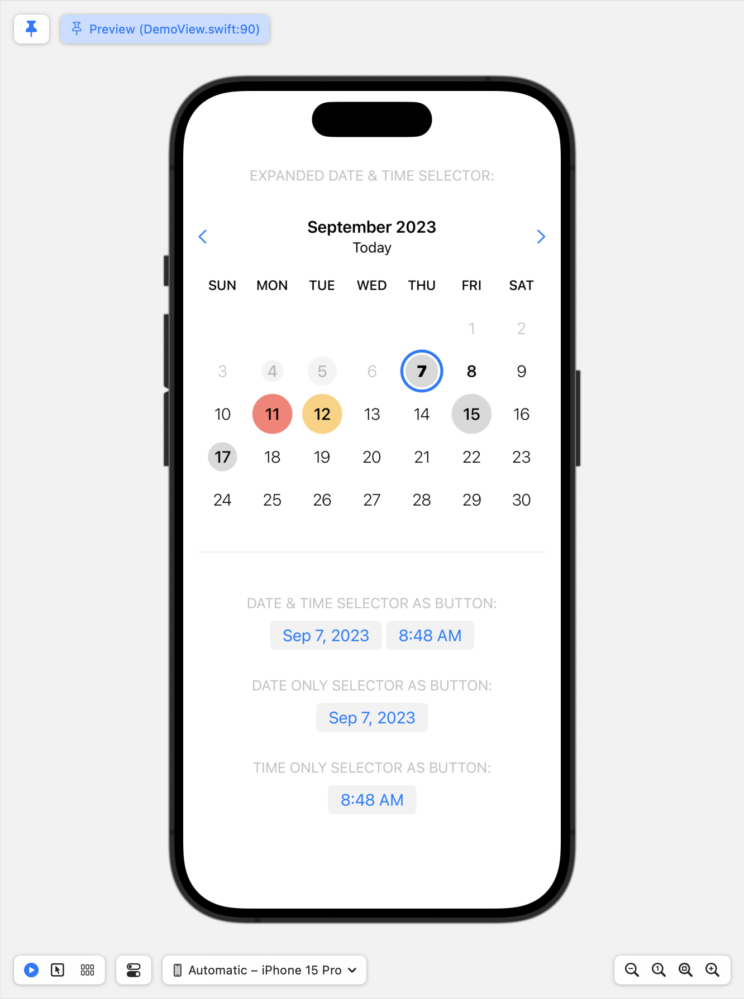

# **DurableDateAndTime** Swift Package

## Overview
A suite of additional date and time functionality, plus a data-driven `DateAndTimeSelector` SwiftUI component for presenting UI to select dates and times.

**WARNING/NOTES:**
* This is an early, **PRE-RELEASE VERSION**, not ready yet for production apps. 
* Time selection in the `DateAndTimeSelector` is only available for iOS. It uses a picker wheel to select the time, which is not available on macOS. An implementation for this will be added later.

## Installation
This code is provided as **Swift Package** you can add to your Xcode project using the following URL:

<code>https://github.com/durablebrandsoftware/durable-date-and-time</code>

Or you can simply download the code in the `Sources` folder and add the files directly to your project if you do not want the versioning and update management provided by **Swift Package Manager**.


## Added `Date` Functionality

Included in the package is an Swift `extension` to the system's built-in `Date` struct that provides a suite of new functionality for working with dates. See `Date+Extension.swift` for all of the additional functionality added to `Date`.

In particular, consider switching to using the `Date.currentDateAndTime` static property whenever your app needs the device's current date and time. Doing so will allow you to temporarily simulate a specific date and time to assist with the development and testing of date-related functionality in your app. Call the `Date.simulateCurrentDateAndTime(...)` static function to simulate a current date and time, and `Date.restoreCurrentDateAndTime(...)` reset it to the real date and time. 

Note that the `DateAndTimeSelector` (see below) uses `Date.currentDateAndTime` internally so that you can control the current date and time it uses as well.

## The `DateAndTimeSelector` Component

The `DateAndTimeSelector` is a custom SwiftUI component that provides UI for selecting dates and times. It is modeled after SwiftUI's `DatePicker` in that it provides both an **expanded (inline) version** that can be displayed directly inside a view, and a **button version** that displays a button that opens a popover for picking dates and times.

The primary benefit of the included `DateAndTimeSelector` is its ability to visualize the amount of activities in its calendar view to help users see how busy each day is. This is accomplished by providing the selector with a `DateAndTimeSelectorDataSource` via the `.dataSource(...)` view modifier:

The following snippet shows how you would embed the expanded version of the selector in a `VStack`. using the selector's `.expanded()` modifier. (Removing the `.expanded()` modifier will cause the selector to display as a button in the `VStack`, which will open a popover for choosing the date.)

```
import DurableDateAndTime
...
@State private var selectedDate: Date = Date.currentDateAndTime
private var myDataSource: DateAndTimeSelectorDataSource!
...
VStack {
    DateAndTimeSelector(selectedDate: $selectedDate)
        .dateOnly()
        .expanded()
        .dataSource(myDataSource)
        .frame(height: 350)
}
```

The `.dateOnly()` modifier restricts the UI of the selector to date selection only, keeping the time of `selectedDate` unchanged. Use the `.timeOnly()` modifier to restrict the UI to time selection, leaving the date unchanged. By default, the selector will show UI for selecting both a date and time.

The `.dataSource(...)` modifier is how you supply a `DateAndTimeSelectorDataSource` to the selector, allowing it to visualize dates in the calendar view.

Also note that you may often want to provide a `.frame(height:)` (and perhaps a `width:` on iPad) for the selector when it is used in its expanded form so that it is constrained to a particular area of your view. Otherwise it will fill the available space.

## Demo

There is a more complete Xcode demo project (`Demo/Demo.xcodeproj`) included in this repo that you can download and run to see the `DateAndTimeSelector` SwiftUI component working in all its various configurations. See the `DemoView.swift` file for the code that generates those variations.



